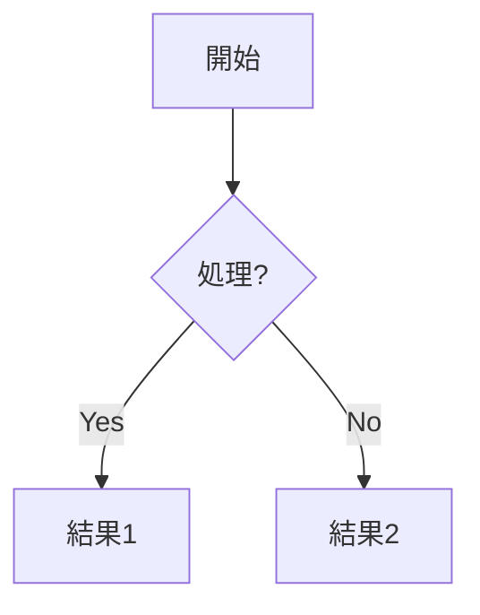

# テストページ

## 画像表示


## コード

```bash
# コードブロック
cd /boot/
```


### コードブロックのネスト

1. 手順
    ```bash
    sudo apt update 
    ```


## mermaid


```mermaid
graph TD
    A[開始] --> B{処理?};
    B -- Yes --> C[結果1];
    B -- No --> D[結果2];
```
